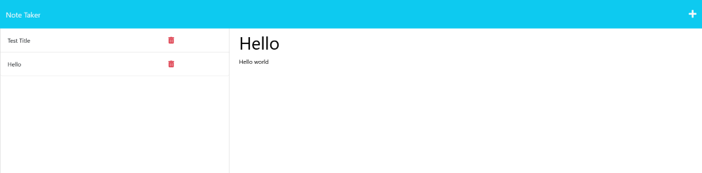

# Note-Taker
note taking app made using node.js and express with heroku

[Repo Url](https://github.com/MasonMarc/Note-Taker)

# Table of Contents

[Descriptions](#descriptions)

[Visuals](#visuals)

[Resources](#resources)

# Descriptions 

Note taking app made with node.js using express and hosted on heroku. allows users to enter note title and text and save note. The note title then appears in the side pane which can be clicked to display the note text. 

# Visuals

# Resources

[inquirer](https://www.npmjs.com/package/inquirer)

[express](https://www.npmjs.com/package/express)

[heroku](https://dashboard.heroku.com)